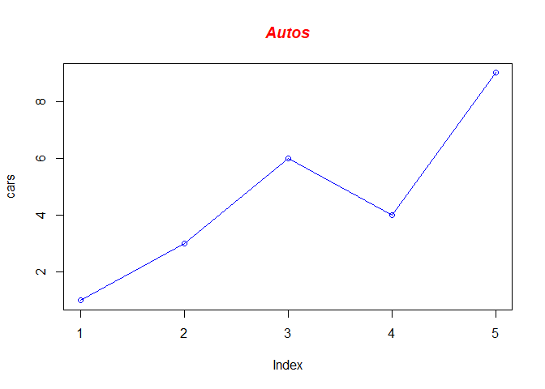

Math 0910: Syllabus
================
Prof. Francois Nguyen
Spring 2023

# Overview:

# Course Description
This course is intended for students who have had one year of high school algebra and need a refresher before taking courses such as College Algebra and/or Pre-Calculus. The topics include a review of solving equations and inequalities and their applications, exponents, and polynomials, factoring polynomials, solving quadratic equations and their applications, rational expressions, rational exponents and radicals.

# Course Learning Outcomes
At the completion of this course, students will be able to:
1.	Identify and understand the basic concepts of algebraic expressions.
2.	Perform operations on polynomial and rational expressions.
3.	Apply the definition of absolute value to solve inequalities and equations involving absolute values.
4.	Find solutions to and graph systems of linear equations and inequalities.
5.	Solve equations involving first and second-degree polynomials and rational expressions.
6.	Manipulate radical expressions using laws of exponents.
7.	Understand basic properties of functions.
8.	Apply properties of rational and radical expressions, polynomials, and absolute value in the context of real-life.


``` r
# Define the cars vector with 5 values
cars <- c(1, 3, 6, 4, 9)

# Graph cars using blue points overlayed by a line 
plot(cars, type="o", col="blue")

# Create a title with a red, bold/italic font
title(main="Autos", col.main="red", font.main=4)
```

<!-- -->

# Course Requirements

A minimum grade of C is required in this course to progress to COURSE.

# Course Objectives:

At the completion of this course, students will be able to:

- Identify and understand the basic concepts of algebraic expressions.
- Perform operations on polynomial and rational expressions.
- Apply the definition of absolute value to solve inequalities and
  equations involving absolute values.
- Find solutions to and graph systems of linear equations and
  inequalities.
- Solve equations involving first and second-degree polynomials and
  rational expressions.
- Manipulate radical expressions using laws of exponents.
- Understand basic properties of functions.
- Apply properties of rational and radical expressions, polynomials, and
  absolute value in the context of real-life

# Course Policies:

## General:

– Computers, Calculators are not to be used unless instructed to do so.
– Quizzes and exams are closed book, closed notes.

## Grade:

makeup quizzes or exams will be given.

– Grades in the C range represent performance that meets expectations;
Grades in the B range represent performance that is substantially better
than the expectations; Grades in the A range represent work that is
excellent.

– Grades will be maintained in the LMS course shell. Students are
responsible for tracking their progress by referring to the online
gradebook.

# Assignments

– Students are expected to work independently. Offering and accepting
solutions from others is an act of plagiarism, which is a serious
offense and all involved parties will be penalized according to the
Academic Honesty Policy.

– Discussion among students is encouraged, but when in doubt, direct
your questions to the professor, tutor, or lab assistant.

– No late assignments will be accepted under any circumstances.

# Attendance and Absences

    ## `geom_smooth()` using formula = 'y ~ x'


– Attendance is expected and will be taken each class. You are allowed
to miss 1 class during the semester without penalty. Any further
absences will result in point and/or grade deductions.

– Students are responsible for all missed work, regardless of the reason
for absence. It is also the absentee’s responsibility to get all missing
notes or materials.

# Academic Honesty Policy Summary:

In addition to skills and knowledge, Saint Paul College aims to teach
students appropriate Ethical and Professional Standards of Conduct. The
Academic Honesty Policy exists to inform students and Faculty of their
obligations in upholding the highest standards of professional and
ethical integrity. All student work is subject to the Academic Honesty
Policy. Professional and Academic practice provides guidance about how
to properly cite, reference, and attribute the intellectual property of
others. Any attempt to deceive a faculty member or to help another
student to do so will be considered a violation of this standard.

# College Policy

The College’s academic honesty policies can be found in the catalog.
Please be assured that there will be absolutely no tolerance for
cheating in any way. All your quizzes and exams must be done
independently with no help from anyone. Make sure you copy the code of
honor statement below and send me an email with your name and date of
the time to confirm you adhere to this course policy: “I will register
for only one account on Mymathlab.com. My answers to homework, quizzes
and exams will be my own work (except for assignments that explicitly
permit collaboration).

I will not make solutions to homework, quizzes or exams available to
anyone else. This includes both solutions written by me, as well as any
official solutions provided by the course instructor. I will not engage
in any other activities that will dishonestly improve my results or
dishonestly improve/hurt the results of others. Your name. Dated on
Jan/…/2023.

# Special Services and Math Tutoring

Special Accommodations: It is college policy to provide reasonable
accommodations to students with disabilities. Please contact the office
of Disability Resources and Access if you wish to discuss this policy.
The Math Center (MC) will be open for drop-in tutoring in room 3125.
This tutoring is FREE and no appointment is necessary.

# Online coursework Integrity Declaration

Online submission of, or placing one’s name on an exam, assignment, or
any course document is a statement of academic honor that the student
has not received or given inappropriate assistance in completing it and
that the student has complied with the Academic Honesty Policy in that
work.

# Consequences

An instructor may impose a sanction on the student that varies depending
upon the instructor’s evaluation of the nature and gravity of the
offense. Possible sanctions include but are not limited to, the
following: (1) Require the student to redo the assignment; (2) Require
the student to complete another assignment; (3) Assign a grade of zero
to the assignment; (4) Assign a final grade of “F” for the course. A
student may appeal these decisions according to the Academic Grievance
Procedure. (See the relevant section in the Student Handbook.) Multiple
violations of this policy will result in a referral to the Conduct
Review Board for possible additional sanctions.

The full text of the Academic Honesty Policy is in the Student Handbook.

# Course Schedule

(See the addedum)

## Week 1, January 9: Introduction to the Course

*Assignment*:

1.  [Bryan, Jennifer. 2016. Chapters 1-16.](http://happygitwithr.com)
    Read this carefully and follow its instructions to get set up with ,
    RStudio, Git, and GitHub on your laptop before we meet.

## Week 2, January 16: The Replication Crisis and Reproducibility

*Readings*:

1.  [Aschwanden, Christie, and Maggie Koerth-Baker. 2016. “How Two Grad
    Students Uncovered an Apparent Fraud—and a Way to Change Opinions on
    Transgender Rights.” *FiveThirtyEight*, April
    7](http://fivethirtyeight.com/features/how-two-grad-students-uncovered-michael-lacour-fraud-and-a-way-to-change-opinions-on-transgender-rights/),
    and [Dimitrova, Velichka. 2013. “Reinhart-Rogoff Revisited: Coding
    Errors Happen—Key Problem Was in Not Making the Data Openly
    Available from the Start.” *LSE: The Impact Blog*, April
    24.](http://blogs.lse.ac.uk/impactofsocialsciences/2013/04/24/reinhart-rogoff-revisited-why-we-need-open-data-in-economics/)
2.  [Data Access and Research Transparency (DA-RT): A Joint Statement by
    Political Science Journal
    Editors.](http://journals.cambridge.org/action/displayAbstract?fromPage=online&aid=9911378&fulltextType=LT&fileId=S2049847015000448)
3.  [*AJPS* Replication and Verification
    Policy](https://ajps.org/ajps-replication-policy/) and [*American
    Journal of Political Science* Guidelines for Preparing Replication
    Files.](https://ajpsblogging.files.wordpress.com/2015/03/ajps-guide-for-replic-materials-1-0.pdf)
4.  [Gelman, Andrew, and Eric Loken. 2013. “The Garden of Forking Paths:
    Why Multiple Comparisons Can Be a Problem, Even When There Is No
    ‘Fishing Expedition’ or ‘*p*-Hacking’ and the Research Hypothesis
    Was Posited Ahead of
    Time.”](http://www.stat.columbia.edu/~gelman/research/unpublished/p_hacking.pdf)
5.  [Leek, Jeffrey T., and Roger D. Peng. 2015. “Opinion: Reproducibile
    Research Can Still Be Wrong: Adopting a Prevention Approach.”
    *Proceedings of the National Academy of Sciences*
    112(6):1645-1646](http://www.pnas.org.proxy.lib.uiowa.edu/content/112/6/1645)
    and [Patil, Prasad, Roger D. Peng, and Jeffrey T. Leek. 2016. “A
    Statistical Definition for Reproducibility and Replicability.”
    *bioRxiv*, July
    29.](http://biorxiv.org/content/biorxiv/early/2016/07/29/066803.full.pdf)

## Week 3, January 23: Chapter-03

*Assignment*:

1.  [Bryan, Jennifer. 2016. Chapters 1-16.](http://happygitwithr.com)
    Read this carefully and follow its instructions to get set up with ,
    RStudio, Git, and GitHub on your laptop before we meet.

## Week 4, January 30: Chapter-04

*Readings*:

1.  [Bryan, Jennifer. 2016. Chapters 1-16.](http://happygitwithr.com)
    Read this carefully and follow its instructions to get set up with ,
    RStudio, Git, and GitHub on your laptop before we meet.
2.  [Bryan, Jennifer. 2016. Chapters 1-16.](http://happygitwithr.com)
    Read this carefully and follow its instructions to get set up with ,
    RStudio, Git, and GitHub on your laptop before we meet.

## Week 5, February 6: Chapter-05

*Readings*:

1.  [Bryan, Jennifer. 2016. Chapters 1-16.](http://happygitwithr.com)
    Read this carefully and follow its instructions to get set up with ,
    RStudio, Git, and GitHub on your laptop before we meet.

## Week 6, February 13: Chapter-06

*Readings*: [Bryan, Jennifer. 2016. Chapters
1-16.](http://happygitwithr.com) Read this carefully and follow its
instructions to get set up with , RStudio, Git, and GitHub on your
laptop before we meet.

## Week 7, February 20: Chapter-07

*Readings*: [Bryan, Jennifer. 2016. Chapters
1-16.](http://happygitwithr.com) Read this carefully and follow its
instructions to get set up with , RStudio, Git, and GitHub on your
laptop before we meet.

## Week 8, February 27: Chapter-08

*Readings*: [Bryan, Jennifer. 2016. Chapters
1-16.](http://happygitwithr.com) Read this carefully and follow its
instructions to get set up with , RStudio, Git, and GitHub on your
laptop before we meet.

## Week 9, March 6: Chapter-09

## Week 10, March 13: Chapter-10

## Week 11, March 20: Chapter-11

## Week 12, March 27: Chapter-12

## Week 13, April 3: Chapter-13

## Week 14, April 10: Chapter-14

## Week 15, April 17: Chapter-15

## Week 16, April 24: Chapter-16

<center>

</center>

``` r
# devtools::install_github("rstudio/gt")
library(gt)
head(mtcars)
```

    ##                    mpg cyl disp  hp drat    wt  qsec vs am gear carb
    ## Mazda RX4         21.0   6  160 110 3.90 2.620 16.46  0  1    4    4
    ## Mazda RX4 Wag     21.0   6  160 110 3.90 2.875 17.02  0  1    4    4
    ## Datsun 710        22.8   4  108  93 3.85 2.320 18.61  1  1    4    1
    ## Hornet 4 Drive    21.4   6  258 110 3.08 3.215 19.44  1  0    3    1
    ## Hornet Sportabout 18.7   8  360 175 3.15 3.440 17.02  0  0    3    2
    ## Valiant           18.1   6  225 105 2.76 3.460 20.22  1  0    3    1

<!-- The sections of code below that include "child=..." are drawing from seperate .md documents. These allow for updating text in a single spot for use in multiple syllabus documents. -->

## COVID policy

Je t’inventerai Des mots insensés Que tu comprendras Je te parlerai De
ces amants là Qui ont vu deux fois Leurs coeurs s’embraser Je te
raconterai L’histoire de ce roi Mort de n’avoir pas Pu te rencontrer Ne
me quitte pas
<https://www.southalabama.edu/coronavirus/vaccineincentive/>

## Disabilities

On a vu souvent Rejaillir le feu De l’ancien volcan Qu’on croyait trop
vieux Il est paraît-il Des terres brûlées Donnant plus de blé Qu’un
meilleur avril Et quand vient le soir Pour qu’un ciel flamboie Le rouge
et le noir Ne s’épousent-ils pas Ne me quitte pas

## Chapter-4

Ne me quitte pas Je ne veux plus pleurer Je ne veux plus parler Je me
cacherai là A te regarder Danser et sourire Et à t’écouter Chanter et
puis rire Laisse-moi devenir L’ombre de ton ombre

## Food insecurity

If you are subject to food insecurity, JagPantry provides a food for
students needing assistance. More information can be found [on their
website](https://www.southalabama.edu/departments/sga/foodpantry.html "JagPantry")

## Mental health

Being a university student is stressful and can negatively impact mental
health. The University Counseling and Testing Center provides
confidential, free counseling and crisis intervention services to
eligible USA students and consultation and outreach services to members
of the USA community. More information can be found [at their
website](https://www.southalabama.edu/departments/counseling/ "Counseling and Testing").

## Writing center

Over the course of this semester, seek help at the Writing Center if you
would like additional guidance and critique. You can access the Writing
Center at [at their
website](https://www.southalabama.edu/departments/academicsuccess/cae/how.it.works.html).
During graduate school, I found workshops and writing groups at the
Writing Center on campus to be helpful in building my motivation and
teaching me new strategies for writing efficiently.
